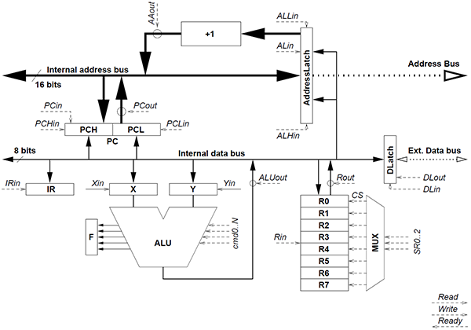

---

# Description

---

Simulateur de la micro-architecture suivante :

Ayant pour jeu d'instructions :

- **NOP**
- **JMP**  _HHLL_
- **JZ** _HHLL_
- **JC** _HHLL_
- **JMP RX0**
- **ST R0, RX**_n_
- **LD R0, RX**_n_
- **ST R**_n_**,** _HHLL_
- **LD R**_n_**,** _HHLL_
- **MV R**_n_**,** _arg#_
- **DEC R**_n_
- **INC R**_n_
- **NOT R**_n_
- **ADD R**_n_**, R**_m_
- **SUB R**_n_**, R**_m_
- **AND R**_n_**, R**_m_
- **SWP R**_n_**, R**_m_

## Fonctionnalités

- Exécuter un programme Héxadecimal
- Afficher le flot d'exécution

## Problèmes

- Pas de conversion du programme héxadecimal en fichier `.s` human-readable 

---

# Utilisation

---

## Compiler

	make

## Exécuter

### Usage

	./proco_sim prog_hex [breakpoints...]

#### Exemples d'exécution sans breakpoints :

	$ ./proco_sim tests/prog1.hex
	### Program start ###

	0000 JMP 04h
	0004 MV R0, FF#
	0006 INC R0
	0007 JZ 0Ch
	000C JC 012h
	
	### Program end ###
	r0 = 0
	r1 = 0
	r2 = 0
	r3 = 0
	r4 = 0
	r5 = 0
	r6 = 0
	r7 = 0

#### Exemple d'exécution avec des points d'arrêt aux adresses 0 et 12 :

	./proco_sim test/prog1.hex 0 12
	### Program start ###

	0000 JMP 04h
	breaked$ s       
	0004 MV R0, FF#
	breaked$ s
	0006 INC R0
	breaked$ p
	r0 = ff
	r1 = 0
	r2 = 0
	r3 = 0
	r4 = 0
	r5 = 0
	r6 = 0
	r7 = 0
	breaked$ s
	0007 JZ 0Ch
	breaked$ p
	r0 = 0
	r1 = 0
	r2 = 0
	r3 = 0
	r4 = 0
	r5 = 0
	r6 = 0
	r7 = 0
	breaked$ c
	000C JC 012h
	breaked$ s
	
	### Program end ###
	r0 = 0
	r1 = 0
	r2 = 0
	r3 = 0
	r4 = 0
	r5 = 0
	r6 = 0
	r7 = 0

##### Le mode breaked

Une fois le programme arrivé sur un point d'arrêt il rentre en mode _breaked_ signalé par un invite de commande : `breaked$`

Les commandes suivantes sont alors disponible :

- **c** _pour continuer le programme jusqu'au prochain point d'arrêt ou jusqu'à la fin_
- **s** _pour exécuter le programme instruction par instruction_
- **p** _pour afficher tous les registres et leur contenu_
